## Hi there, This is Nick👋

  <!-- Option 1: Use the SVG directly -->
  
  <!-- Option 2: Or use enhanced typing SVG -->
  

## 🚀 About Me

I am passionate in building in AI, Web3 sector for futuristic tech. From Finance to DeFi, then dived deep in AI powered communication, payments, infra and more. Love building scalable solutions, contributing to open source, and staying at the forefront of technology innovation.

- 📫 Reach me at **[nickncnn@gmail.com]**

## 🛠️ Tech Stack

### Languages & Core Technologies

### Frontend & Web3

### Blockchain Development

### AI/ML & Data

### Cloud & Infrastructure

### Financial Engineering

